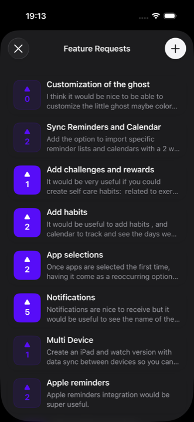
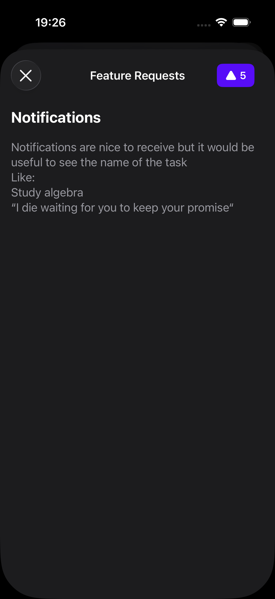
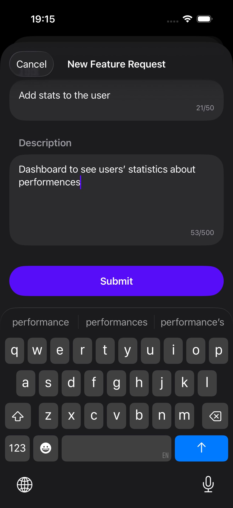

# FeaturePulse iOS SDK

A modern SwiftUI-only SDK for collecting and managing feature requests from your iOS app users.

## Features

✅ **SwiftUI-Only** - Pure SwiftUI implementation, no UIKit dependencies  
✅ **Modern Swift 6.0** - Uses `@Observable`, async/await, and Swift Concurrency  
✅ **Type-Safe Localization** - String Catalogs with compile-time checking  
✅ **Multi-Language Support** - English, Spanish, French, German, Italian, Portuguese included  
✅ **Customizable** - Override any translation or appearance setting
✅ **Simple Integration** - Just 3 lines of code to get started

## Screenshots

<p align="center">
  
  
  
</p>

## Requirements

- iOS 17.0+
- macOS 14.0+
- Swift 6.0+
- Xcode 15.0+

## Installation

### Swift Package Manager

Add FeaturePulse to your project in Xcode:

1. File > Add Package Dependencies
2. Enter package URL: `https://github.com/featurepulse/feature-pulse-ios`
3. Select version and add to your target

Or add to your `Package.swift`:

```swift
dependencies: [
    .package(url: "https://github.com/featurepulse/feature-pulse-ios", from: "1.0.0")
]
```

## Quick Start

### 1. Configure API Key

In your app's initialization (e.g., `@main` struct):

```swift
import SwiftUI
import FeaturePulse

@main
struct MyApp: App {
    init() {
        // Required: Your API key from featurepul.se
        FeaturePulse.shared.apiKey = "your-api-key-here"

        // Optional: Customize primary color
        FeaturePulse.shared.primaryColor = .red

        // Optional: Set user payment tier
        FeaturePulse.shared.updateUser(payment: .free)
    }

    var body: some Scene {
        WindowGroup {
            ContentView()
        }
    }
}
```

### 2. Add to Your UI

Choose from multiple integration patterns:

## Usage Examples

### Example 1: In a Tab Bar

```swift
import SwiftUI
import FeaturePulse

struct ContentView: View {
    var body: some View {
        TabView {
            HomeView()
                .tabItem {
                    Label("Home", systemImage: "house")
                }

            FeaturePulse.shared.view()
                .tabItem {
                    Label("Feedback", systemImage: "lightbulb")
                }
        }
    }
}
```

### Example 2: As a Modal Sheet

Present with NavigationStack and close button:

```swift
import SwiftUI
import FeaturePulse

struct ContentView: View {
    @State private var show = false

    var body: some View {
        Button("Feature Requests") {
            show = true
        }
        .sheet(isPresented: $show) {
            NavigationStack {
                FeaturePulse.shared.view()
                    .toolbar {
                        ToolbarItem(placement: .topBarLeading) {
                            if #available(iOS 26, *) {
                                Button(role: .close) {
                                    show = false
                                }
                            } else {
                                Button {
                                    show = false
                                } label: {
                                    Label("Close", systemImage: "xmark")
                                }
                            }
                        }
                    }
            }
        }
    }
}
```

### Example 3: As a Navigation Link

```swift
import SwiftUI
import FeaturePulse

struct SettingsView: View {
    var body: some View {
        NavigationStack {
            List {
                NavigationLink {
                    FeaturePulse.shared.view()
                } label: {
                    Label(FeaturePulse.L10n.featureRequests, systemImage: "lightbulb")
                }
            }
            .navigationTitle("Settings")
        }
    }
}
```

### Example 4: As a Root View

```swift
import SwiftUI
import FeaturePulse

struct FeedbackView: View {
    var body: some View {
        NavigationStack {
            FeaturePulse.shared.view()
        }
    }
}
```

That's it! Your users can now submit and vote on feature requests.

## Configuration

### Complete Configuration Example

```swift
import FeaturePulse

// API Configuration
FeaturePulse.shared.apiKey = "your-api-key-here"

// Appearance
FeaturePulse.shared.primaryColor = .red
FeaturePulse.shared.foregroundColor = .white

// Payment Tier (with currency)
FeaturePulse.shared.updateUser(payment: .free)
FeaturePulse.shared.updateUser(payment: .weekly(2.99, currency: "USD"))
FeaturePulse.shared.updateUser(payment: .monthly(9.99, currency: "USD"))
FeaturePulse.shared.updateUser(payment: .yearly(79.99, currency: "USD"))
FeaturePulse.shared.updateUser(payment: .lifetime(199.99, currency: "USD"))
```

### Customize Colors

Change the primary color and foreground colors to match your app's brand:

```swift
// Primary color (used for vote buttons, submit button, and CTA button background)
FeaturePulse.shared.primaryColor = .blue
FeaturePulse.shared.primaryColor = .red
FeaturePulse.shared.primaryColor = Color(red: 87/255, green: 13/255, blue: 248/255)

// Foreground color (used for button text and icons with colored backgrounds)
FeaturePulse.shared.foregroundColor = .white  // Default: white
FeaturePulse.shared.foregroundColor = .black  // For light backgrounds
FeaturePulse.shared.foregroundColor = Color(red: 1.0, green: 1.0, blue: 1.0)  // Custom color
```

**Note:**
- The default `foregroundColor` is white, which works well with most primary colors
- Make sure foreground color has good contrast with your primary color for accessibility

### Custom User ID

You can optionally set a custom user ID to link the device ID with your own internal user identification system:

```swift
// Set custom user ID (e.g., from your authentication system)
FeaturePulse.shared.updateUser(customID: "user_123")

// Clear custom ID
FeaturePulse.shared.updateUser(customID: nil)
```

This is useful for:
- Linking feature requests to your internal user database
- Tracking the same user across multiple devices
- Associating feedback with specific user accounts

### Payment Tracking

Track user payment tiers to understand your customer base. **Currency is required** for all payment tiers (except `.free`).

```swift
// Free users
FeaturePulse.shared.updateUser(payment: .free)

// Weekly subscription ($2.99/week = ~$12 MRR)
FeaturePulse.shared.updateUser(payment: .weekly(2.99, currency: "USD"))

// Monthly subscription ($9.99/month = $9.99 MRR)
FeaturePulse.shared.updateUser(payment: .monthly(9.99, currency: "USD"))

// Yearly subscription ($79.99/year = ~$6.67 MRR)
FeaturePulse.shared.updateUser(payment: .yearly(79.99, currency: "USD"))

// Lifetime purchase ($199.99 amortized over 24 months = ~$8.33 MRR)
FeaturePulse.shared.updateUser(payment: .lifetime(199.99, currency: "USD"))

// Custom lifetime amortization period
FeaturePulse.shared.updateUser(
    payment: .lifetime(199.99, currency: "USD", expectedLifetimeMonths: 36)
)
```

**Payment Tier Benefits:**
- Track MRR (Monthly Recurring Revenue) from your app
- Understand which features paying customers want
- Segment feedback by customer value
- Make data-driven prioritization decisions

#### Multi-Currency Support

FeaturePulse supports 20+ major currencies. Specify the currency code using ISO 4217 standard:

```swift
// Examples with different currencies
FeaturePulse.shared.updateUser(payment: .monthly(9.99, currency: "USD"))  // US Dollar
FeaturePulse.shared.updateUser(payment: .monthly(8.99, currency: "EUR"))  // Euro
FeaturePulse.shared.updateUser(payment: .monthly(7.99, currency: "GBP"))  // British Pound
FeaturePulse.shared.updateUser(payment: .yearly(99.99, currency: "CAD")) // Canadian Dollar
FeaturePulse.shared.updateUser(payment: .monthly(699, currency: "JPY"))   // Japanese Yen
```

**Supported Currencies:**
USD, EUR, GBP, CAD, AUD, JPY, CHF, CNY, INR, BRL, MXN, SEK, NOK, DKK, PLN, SGD, HKD, KRW, TRY, ZAR

All amounts are automatically converted to USD for MRR calculations in the dashboard, while preserving your original currency for accurate tracking.

### Feature Request Restrictions

Restrict feature request creation to paying users while allowing everyone to vote. This is perfect for:
- Preventing spam from free users
- Encouraging upgrades to paid tiers
- Maintaining high-quality feedback

**How it works:**
1. Enable "Require Subscription to Create Feature Requests" in your dashboard (Project Settings)
2. The SDK automatically checks permissions from the API
3. Free users see a restriction message, paying users can create requests
4. Everyone can still vote on existing requests

**Default behavior (no code needed):**

```swift
// By default, shows alert: "Only Pro users can add new feature requests..."
// The SDK handles this automatically based on API permissions
```

**Customize the subscription name:**

```swift
// In your app initialization
FeaturePulse.shared.restrictionMode = .alert(subscriptionName: "Premium")
// Alert: "Only Premium users can add new feature requests..."
```

**Custom paywall handling:**

```swift
// In your app initialization
FeaturePulse.shared.restrictionMode = .callback {
    // Your custom logic - show paywall, navigate to subscription screen, etc.
    showPaywallSheet()
}
```

**Important:** The restriction checks `payment_type`, not MRR. This means:
- ✅ **Paid users** (weekly, monthly, yearly, lifetime) → Can create feature requests
- ✅ **Gifted subscriptions** → Can create (even with $0 MRR)
- ❌ **Free users** → Cannot create feature requests
- ✅ **Everyone** → Can vote on existing requests

### Session Tracking & Engagement Metrics

Track user app opens to measure engagement:

```swift
@main
struct YourApp: App {
    var body: some Scene {
        WindowGroup {
            ContentView()
                .featurePulseSessionTracking()  // Add this modifier to your root view
        }
    }
}
```

**That's it!** No configuration needed. The modifier automatically:
- Tracks app opens when your app becomes active (foreground)
- Uses 30-minute timeout (Firebase-style) to avoid counting quick app switches
- Stores session data in UserDefaults
- Sends session data to FeaturePulse backend

**Engagement Tiers:**
- 🔥 **Power User** (20+ sessions/month)
- ⚡ **Active User** (10-19 sessions/month)
- 👍 **Regular User** (5-9 sessions/month)
- 💤 **Casual User** (2-4 sessions/month)
- 👻 **Ghost User** (0-1 sessions/month)

**Benefits:**
- Understand user engagement patterns
- See engagement badges in dashboard
- Identify your most active users
- Track app usage alongside feature requests

### RevenueCat Integration Example

If you're using [RevenueCat](https://www.revenuecat.com/) for subscriptions, here's how to automatically sync payment info:

```swift
import FeaturePulse
import RevenueCat

// Call this when you receive customer info updates
func syncRevenueCatToFeaturePulse(userPurchases: UserPurchasesManager) {
    guard
        let customerInfo = userPurchases.customerInfo,
        userPurchases.subscriptionActive,
        let entitlement = customerInfo.entitlements[Constants.revenueCatEntitlementIdentifier],
        let currentOffering = userPurchases.offerings?.current
    else {
        FeaturePulse.shared.updateUser(payment: .free)
        return
    }

    let productId = entitlement.productIdentifier
    guard let matchedPackage = currentOffering.availablePackages.first(where: {
        $0.storeProduct.productIdentifier == productId
    }) else {
        FeaturePulse.shared.updateUser(payment: .free)
        return
    }

    let price = matchedPackage.storeProduct.price
    let currency = matchedPackage.storeProduct.currencyCode ?? "USD"
    let payment: FeaturePulse.Payment = {
        switch matchedPackage.packageType {
        case .weekly:
            return .weekly(price, currency: currency)
        case .monthly:
            return .monthly(price, currency: currency)
        case .annual:
            return .yearly(price, currency: currency)
        case .lifetime:
            return .lifetime(price, currency: currency, expectedLifetimeMonths: 24)
        default:
            return .free
        }
    }()

    FeaturePulse.shared.updateUser(payment: payment)
}
```

**Integration Tips:**
- Call this function whenever RevenueCat customer info updates
- Use `Purchases.shared.getCustomerInfo()` to get current state
- Set up a listener: `Purchases.shared.delegate = self`
- Payment tiers will be automatically synced to FeaturePulse

## Localization

FeaturePulse includes translations for:

- 🇬🇧 English
- 🇪🇸 Spanish (Español)
- 🇫🇷 French (Français)
- 🇩🇪 German (Deutsch)
- 🇮🇹 Italian (Italiano)
- 🇵🇹 Portuguese (Português)

The SDK automatically uses the user's device language. No additional configuration needed!

### Adding More Languages

To add more languages:

1. Open `Localizable.xcstrings` in Xcode
2. Click "+" to add a new language
3. Translate all strings
4. Rebuild the package

## API Reference

### FeaturePulse (FeaturePulseConfiguration)

Main configuration singleton. `FeaturePulse` is a typealias for `FeaturePulseConfiguration`.

```swift
// Required
FeaturePulse.shared.apiKey: String

// Optional Appearance
FeaturePulse.shared.primaryColor: Color
FeaturePulse.shared.foregroundColor: Color

// Optional Restriction Mode
FeaturePulse.shared.restrictionMode: FeaturePulse.RestrictionMode?

// Methods
FeaturePulse.shared.updateUser(customID: String?)
FeaturePulse.shared.updateUser(payment: Payment)
FeaturePulse.shared.view() -> FeaturePulseView
```

### Views

- `FeaturePulseView()` - Main view with feature requests list
- `FeaturePulse.shared.view()` - Convenience method that returns `FeaturePulseView()` instance

### Payment Types

```swift
enum Payment {
    case free
    case weekly(Decimal, currency: String)
    case monthly(Decimal, currency: String)
    case yearly(Decimal, currency: String)
    case lifetime(Decimal, currency: String, expectedLifetimeMonths: Int = 24)
}
```

### Restriction Modes

```swift
enum FeaturePulse.RestrictionMode {
    case alert(subscriptionName: String = "Pro")
    case callback(() -> Void)
}
```

## Getting Your API Key

1. Sign up at [featurepul.se](https://featurepul.se)
2. Create a new project
3. Copy your API key from the project settings
4. Add it to your app configuration

## Privacy & Data Collection

FeaturePulse SDK includes a **Privacy Manifest** (`PrivacyInfo.xcprivacy`) that declares all data collection and API usage according to [Apple's Privacy Manifest requirements](https://developer.apple.com/documentation/bundleresources/privacy-manifest-files).

### Data Collected

The SDK collects the following data (all optional except device identifier):

- **Device Identifier**: Persistent device ID for analytics and feature request attribution
- **Payment Information**: Optional, for MRR tracking (payment tier only, not payment details)
- **App Usage**: App opens and feature request submissions for engagement metrics

### Privacy Features

- ✅ **No Tracking**: The SDK does not track users across apps or websites
- ✅ **Minimal Data**: Only collects device ID, payment tier, and app usage
- ✅ **Privacy-First**: All data collection is transparent and declared in the privacy manifest
- ✅ **App Store Compliant**: Privacy manifest ensures App Store submission compliance

### For App Developers

When submitting your app to the App Store, Xcode will automatically merge the SDK's privacy manifest with your app's privacy manifest. No additional configuration needed!

## Support

- 🐛 Issues: [GitHub Issues](https://github.com/featurepulse/feature-pulse-ios/issues)

## License

MIT License - see LICENSE file for details

## Credits

Built with ❤️ using SwiftUI and modern Swift concurrency.

---

**Made by [FeaturePulse](https://featurepul.se)** - The simplest way to collect feature requests from your iOS app.
